# Product Backlog: Counseling Appointment System

This document contains the initial product backlog for the Counseling Appointment System, prioritized by core booking flow, notifications, and progressive features.

### 1. Core Booking Flow & Availability

| ID | Title | User Story | Story Points | Risk Level | Checkpoint Release |
| :--- | :--- | :--- | :---: | :---: | :---: |
| **US01** | View Counselor List | **As a student**, I want to view a list of available counselors and their specialties so that I can choose one that fits my needs. | 2 | Low | Yes |
| **US02** | View Available Slots | **As a student**, I want to view a calendar of available time slots for a specific counselor so that I can find a time that works with my schedule. | 5 | Medium | Yes |
| **US03** | Book Time Slot | **As a student**, I want to select and book an available time slot so that I can secure a counseling session. | 8 | High | Yes |
| **US04** | Cancel or Reschedule | **As a student**, I want to cancel or reschedule an upcoming appointment so that I can free up the slot if my plans change. | 5 | Medium | Yes |
| **US05** | Set Availability | **As a counselor**, I want to set my available working hours and recurring breaks so that students only book slots when I am actually available. | 5 | Medium | Yes |
| **US06** | View Appointments | **As a counselor**, I want to view my daily and weekly appointment schedule on a dashboard so that I can prepare for my upcoming sessions. | 3 | Low | Yes |

### 2. Notifications & Tracking

| ID | Title | User Story | Story Points | Risk Level | Checkpoint Release |
| :--- | :--- | :--- | :---: | :---: | :---: |
| **US07** | Student Booking Confirmation | **As a student**, I want to receive an automated email confirmation when I book an appointment so that I have a reliable record of the schedule. | 3 | Medium | Yes |
| **US08** | Student Appointment Reminder | **As a student**, I want to receive an automated reminder 24 hours before my appointment so that I don't forget and miss the session. | 5 | High | Yes |
| **US09** | Counselor Booking Confirmation| **As a counselor**, I want to receive an automated email confirmation when someone books an apointment with me so that I have a reliable record of the schedule. | 3 | Medium | Yes |
| **US10** | Counselor Appt Reminder | **As a counselor**, I want to receive an automated reminder 24 hours before the appointment booked with me so that I don't forget and miss the session. | 5 | High | Yes |
| **US11** | Mark No-Show | **As a counselor**, I want to be able to mark an appointment as a "no-show" directly from my dashboard so that the office can track attendance. | 2 | Low | No |
| **US12** | View Appointment History | **As a student**, I want to view my past and upcoming appointment history so that I can keep track of my counseling journey. | 3 | Low | No |

### 3. Progressive Features

| ID | Title | User Story | Story Points | Risk Level | Checkpoint Release |
| :--- | :--- | :--- | :---: | :---: | :---: |
| **US13** | Submit Intake Form | **As a student**, I want to fill out a secure pre-session intake form during the booking process so that my counselor has context before we meet. | 5 | High | No |
| **US14** | Submit Session Feedback | **As a student**, I want to submit an anonymous post-session feedback form so that I can evaluate the helpfulness of the service. | 3 | Low | No |
| **US15** | View Admin Analytics | **As an admin**, I want to view aggregate no-show tracking and analytics so that I can identify trends and improve clinic efficiency. | 8 | Medium | No |
| **US16** | Manage Counselor Profiles | **As an admin**, I want to manage counselor profiles, system access, and roles so that the platform remains secure and up to date. | 3 | Low | No |

### Screenshot of backlog:

## CRC Tables

Each card identifies one of the system's core classes, describes what it is responsible for, and lists the other classes it must interact with to carry out those responsibilities. User story references are included for traceability back to the product backlog. We group them in 3 layers.

### Actors CRCs

Student, Counselor, Admin: the human roles that interact with the system.

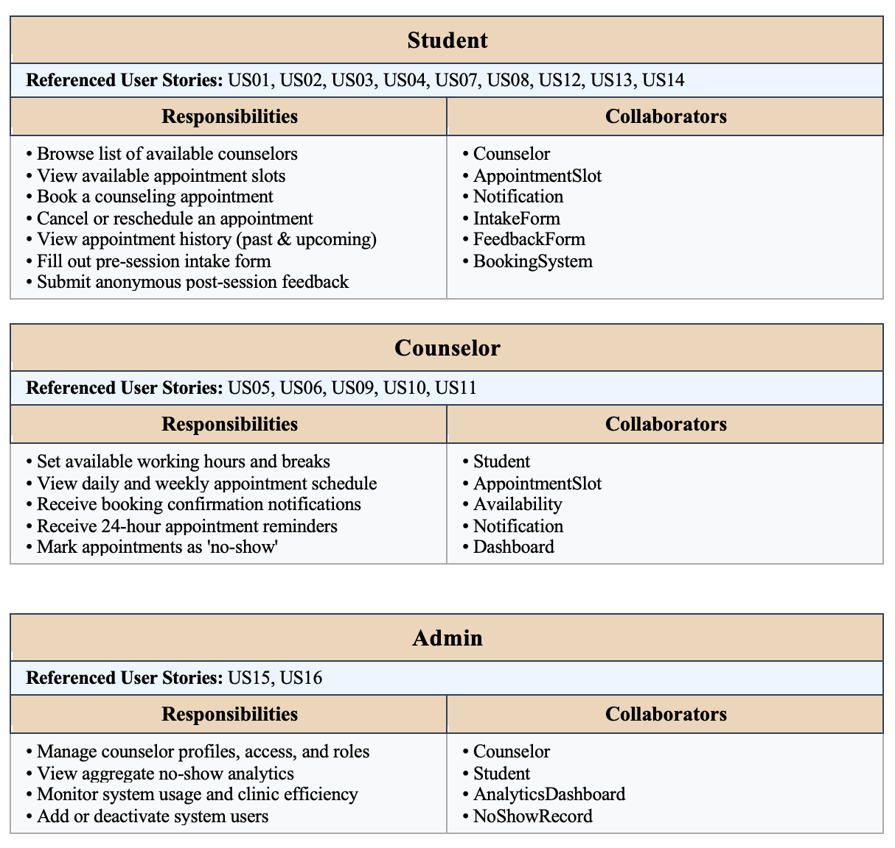

### Core Domain CRCs

AppointmentSlot, Availability, BookingSystem: the central scheduling logic.

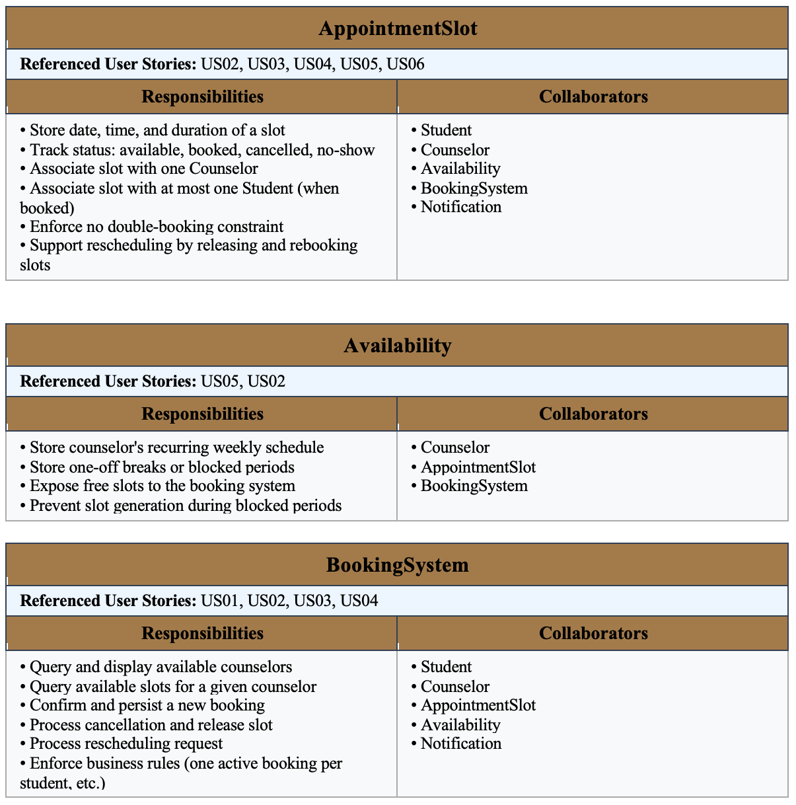

### Support Services CRCs

IntakeForm, FeedbackForm, NoShowRecord: features that support the core flow.

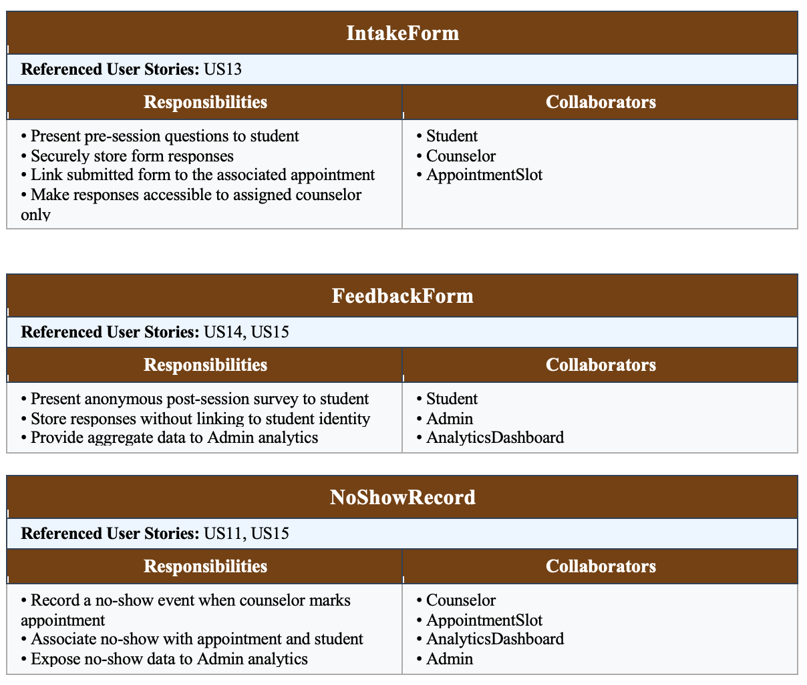

Sc

## 🔗 Figma Project
Access the interactive high-fidelity prototype here:  
**[Figma Design File](https://www.figma.com/design/hfGdG7uPsVATekhhlydlSo/SE-Project?node-id=0-1&t=TYQRLZJySw3304cT-1)**

---

# 🎬 Project Storyboard & User Journey

This section demonstrates the user flow and transitions between different states of the UI, covering all **16 User Stories**.

### 📱 UI Gallery (Overview)

| Student Dashboard | Counselor Search | Booking Flow |
| :---: | :---: | :---: |
| 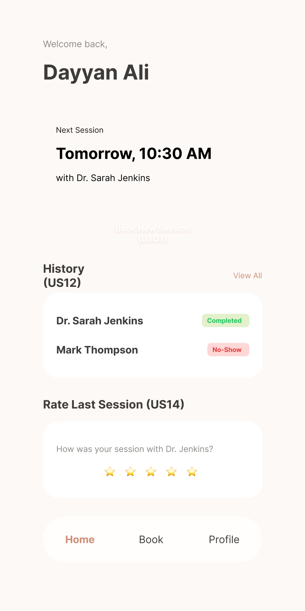 | 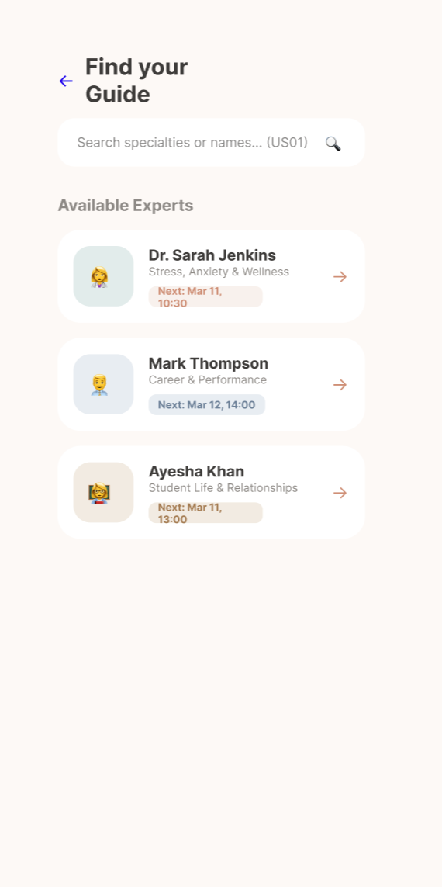 |  |
| **Intake Form** | **Appt Details** | **Counselor Hub** |
| 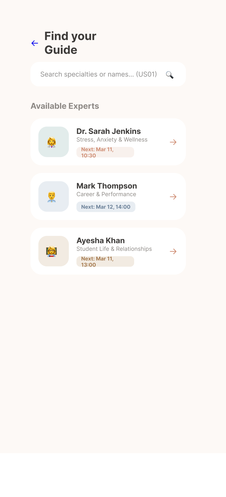 | 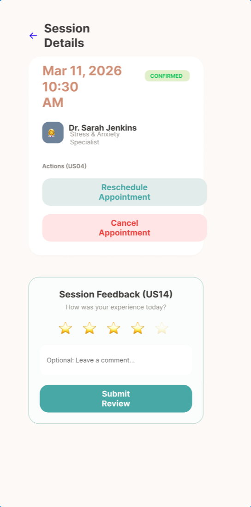 | 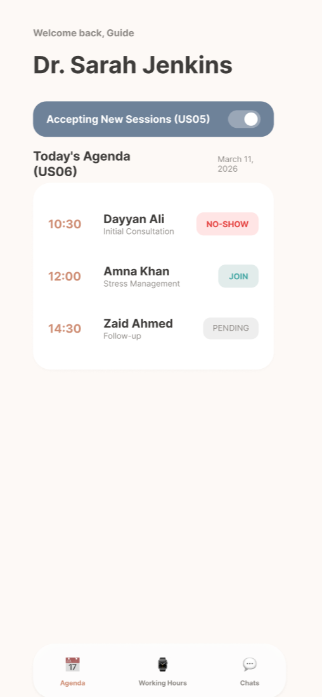 |
| **Admin Center** | **Notifications** | **Feedback Form** |
| 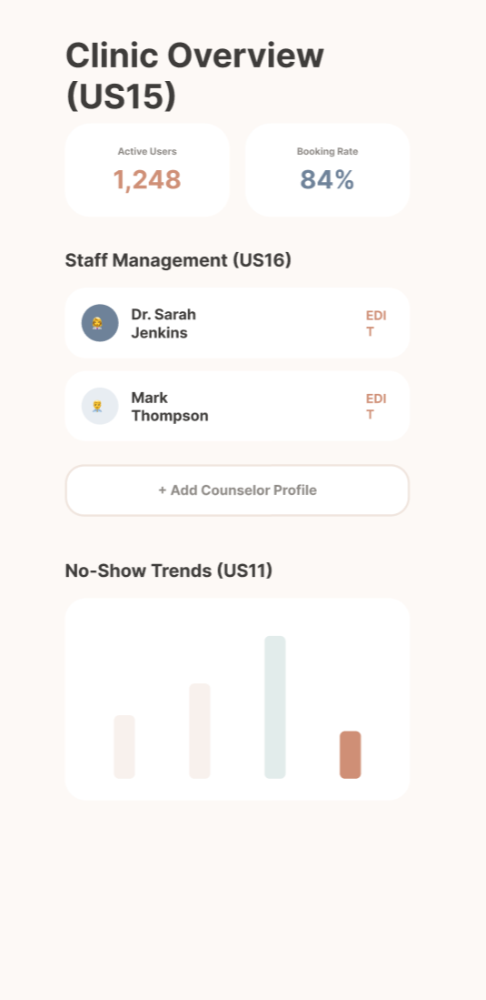 | 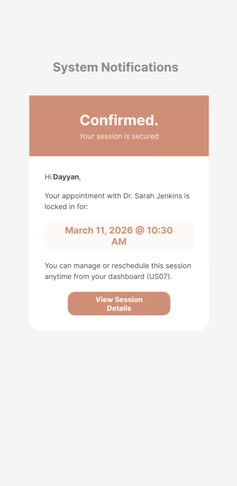 | 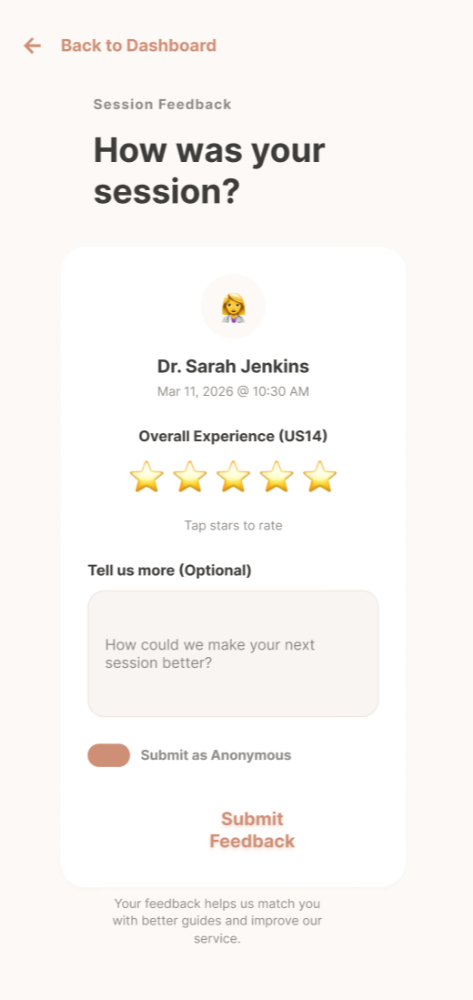 |

---

### Step 1: Student Dashboard (US12)
*   **Initial State:** User logs in to the mobile app.
*   **Action:** User views upcoming sessions and history.
*   **Transition:** User clicks "Schedule New Session" to find a guide.

---

### Step 2: Counselor Discovery (US01)
*   **Initial State:** Search directory of available counselors.
*   **Action:** User filters by specialty and selects "Dr. Sarah Jenkins".
*   **Transition:** System loads the counselor's private booking calendar.

---

### Step 3: Booking Flow (US02, US03)
*   **Initial State:** Calendar view with available slots.
*   **Action:** User selects a date and a 10:30 AM time slot.
*   **Transition:** State changes to "Data Intake" to collect pre-session info.

---

### Step 4: Pre-Session Intake (US13)
*   **Initial State:** Form asking for current mood and goals.
*   **Action:** User fills out the form and clicks "Confirm & Finish".
*   **Transition:** Data is recorded, and system triggers confirmation notifications.

---

### Step 5: Appointment Management (US04)
*   **Initial State:** Confirmation/Detail view.
*   **Action:** User can view active details or choose to Reschedule/Cancel.
*   **Transition:** User returns to dashboard or modifies the appointment.

---

### Step 6: Session Feedback (US14)
*   **Initial State:** Post-session reflection screen.
*   **Action:** User provides a star rating and anonymous comments.
*   **Transition:** Feedback is stored for admin analytics and quality control.

---

### Step 7: Counselor Hub (US05, US06, US11)
*   **Initial State:** Counselor's daily agenda.
*   **Action:** Counselor toggles availability or marks a "No-Show".
*   **Transition:** System updates real-time availability for students.

---

### Step 8: Admin Center (US15, US16)
*   **Initial State:** Clinic overview dashboard.
*   **Action:** Admin monitors no-show trends and manages staff profiles.
*   **Transition:** Administrative updates propagate throughout the system.

---

### Step 9: System Notifications (US07, US08, US09, US10)
*   **Result:** Automated emails sent to both Student and Counselor.
*   **Content:** Confirmation details and 24-hour reminders.

---

## Meeting Minutes

### Meeting 1 — February 20, 2026
| Field | Info |
|-------|------|
| Date | February 20, 2026 |
| Time | 7:34 PM – 7:39 PM |
| Duration | 5 minutes |
| Meeting With | TA |

**Attendees:** Iyan Aamir Aslam, Dayyan Ali Akhtar, Qayyum Ahmed, Shaheer Ahmad, Eman Nabeel

**Discussion:**
The team met with the TA to discuss the initial phase of the Counseling Appointment System project. We went over how to set up our GitHub Organization, repository structure, and Wiki for managing project artifacts. The meeting also covered the basics of building our product backlog, which would later outline the core features of our Counseling Appointment System, designed to streamline session booking between students and counselors.

## Meeting Minutes

### Meeting 2 — March 5, 2026
| Field | Info |
|-------|------|
| Date | March 5, 2026 |
| Time | 3:00 PM – 3:10 PM |
| Duration | 10 minutes |
| Meeting With | TA |

**Attendees:** Iyan Aamir Aslam, Dayyan Ali Akhtar, Qayyum Ahmed, Shaheer Ahmad, Eman Nabeel

**Discussion:**  
The team met with the TA to discuss the product backlog, the requirements for the first deliverable, and questions related to the CRC tables. The TA reviewed the team’s progress and clarified the structure and purpose of the backlog items and class responsibilities.

### Meeting 3 — March 18, 2026
| Field | Info |
|-------|------|
| Date | March 18, 2026 |
| Time | 7:25 PM – 7:40 PM |
| Duration | 15 minutes |
| Meeting With | TA |

**Attendees:** Iyan Aamir Aslam, Dayyan Ali Akhtar, Qayyum Ahmed, Shaheer Ahmad

**Discussion:**  
The team met with the TA to present and discuss the CRC tables and the UI gallery. The TA reviewed the class responsibilities, interactions, and the overall UI flow shown in the gallery, and provided feedback on the consistency between the backlog, CRC tables, and prototype screens.## Meeting Minutes